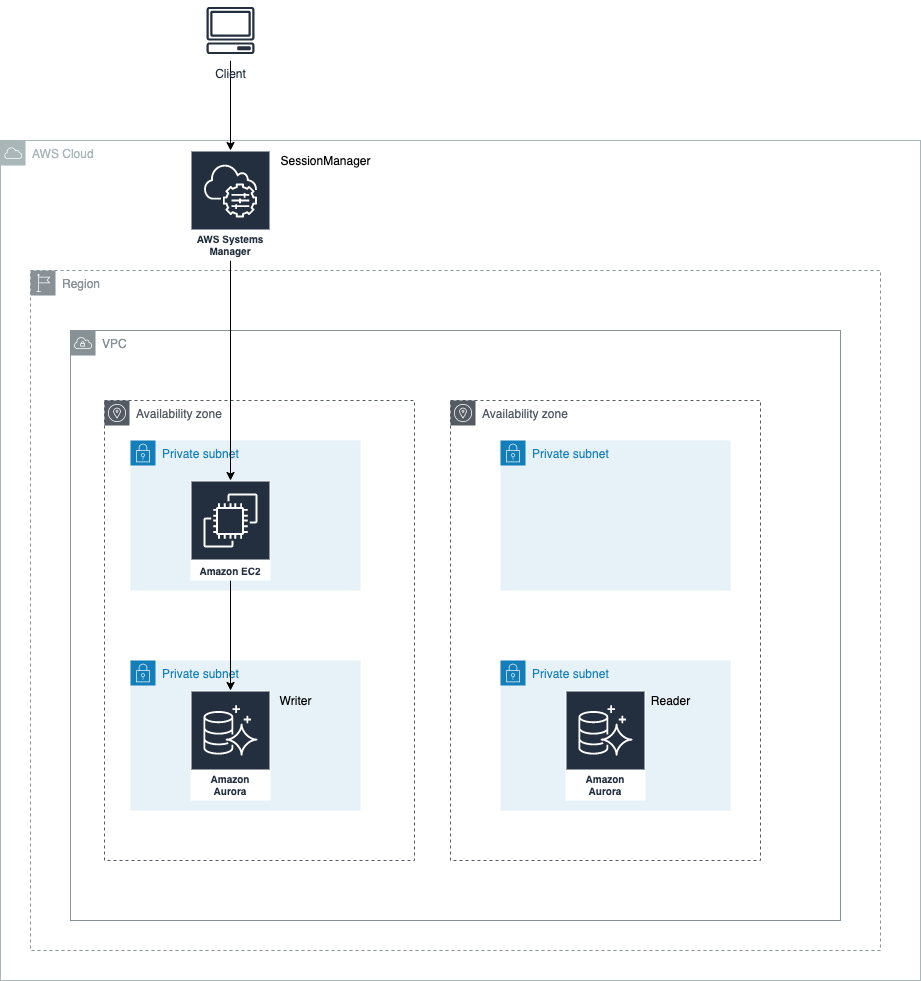
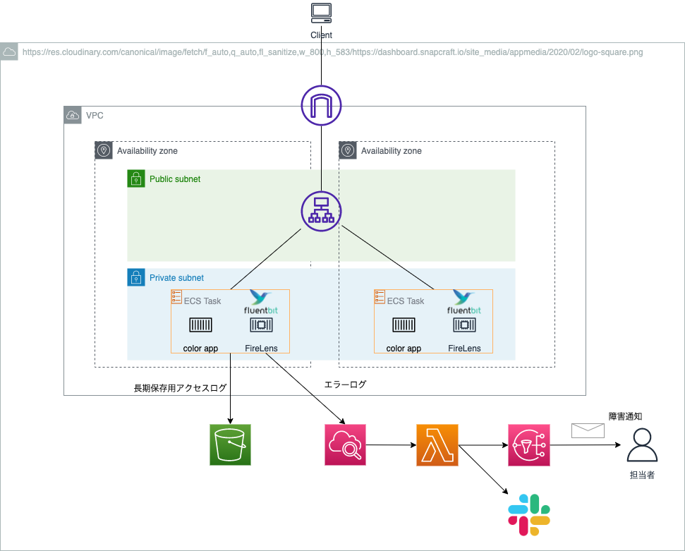

# AWS気になることあれこれ

自分がたまに分からなくなること・誰かがハマりそうなポイントなどをハンズオンで学習する。

また、可能な限りハンズオンの後はTerraformでリソースを作る。

## プライベートサブネットのEC2にSSMで接続して、ただpingする

やってみたコードは[こちら](./private_subnet_connection/doc.md)
## CloudFrontとS3とACMでHTTPS通信

やってみたコードは[こちら](./cloudfront_s3_acm/doc.md)

- zenn.devで記事公開
  - https://zenn.dev/bun913/articles/27be589a095fd4
- こだわりポイント
    - 独自ドメインを取得してCloudFrontに適用
    - SSL通信を可能にする
    - かつCloudFront経由でしかS3のオブジェクトを取得できないように設定
## TerraformでRDSを起動。セキュアにパスワードも管理する

やってみたコードは[こちら](./aurora/doc.md)

- zenn.devで記事公開
  - https://zenn.dev/bun913/articles/92033f05ed7907
- こだわりポイント
  - Terraformでパスワードをセキュアに扱う
    - *.tfファイルには一旦登録するダミーパスワードが残る
    - local_execを利用してtfstateにも本当のパスワード情報を残さない
  - DB接続用EC2インスタンスはセッションマネージャーで接続し、プライベートサブネットに配置する
## シンプルアプリをFARGATEで起動。CodePipelineでデプロイを継続的にデリバリー

やってみたコードは[こちら](./simple_ecs_app/README.md)

- こだわりポイント
  - TerraformでECSをFARGATE実行環境で作成
  - CodePipelineでブルーグリーンデプロイを実現
## FARGATEアプリのログをFirelensでデリバリー。エラーログと長期保存用ログを分けて保管

やってみたコードは[こちら](./ecs_cloudwatch_logs/README.md)

- zenn.devで記事公開
  - https://zenn.dev/bun913/articles/c25765744352a4
  - https://zenn.dev/bun913/articles/7c6c3a1ed53087
- こだわりポイント
  -  ログ収集に極力お金はかけない
  -  エラーログはCloudWatchLogsへ
  -  長期保存のためのログはS3へ配信

## CloudFrontのCORS設定を入れる

やってみたコードは[こちら](./cloudfront_cors_setting/README.md)

- zenn.devで記事公開
  - https://zenn.dev/bun913/articles/cloudfront-cors-policies
- こだわりポイント
  - 極めて普通だが、CloudFrontにCORSの設定を追加
  - 特定のOriginにだけクロスオリジンリクエストを許可
  - どのような設定かはzennをご覧ください