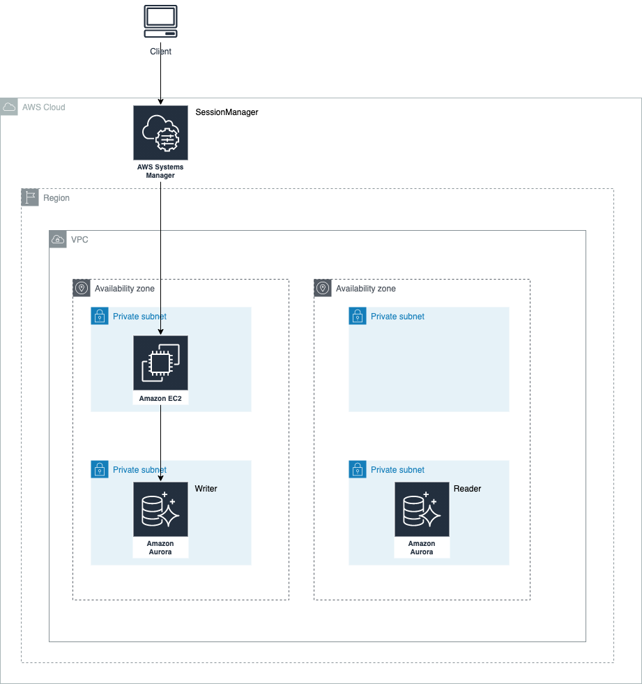

# TerraformでAWSのAuroraを作成する際にパスワードをセキュアに取りあつかう

以下のような構成でプライベートサブネットに設置したEC2にSessionManagerでアクセスし、MySQLへの接続を確認する。
その際パスワードをTerraform上で扱わず、セキュアにパラメーターストアから取得する

## 実際にどのような手順でやっていたかはzennのスクラップを参照

https://zenn.dev/bun913/scraps/8fbc0534fd1a79

## 前提条件

- AWSのパラメーターストアからシークレット情報を取得するため、事前にパラメーターストアにセキュアなパスワードを入れておく必要がある。
  - 上記パスワードをDBクラスターが作成されたタイミングで `local-exec` により設定を行う
  - local-exec による terraform外からの実行のためtfstateにも出力さない
  - あくまでtf上に残るのは、最初にダミーで設定したパスワードの情報だけ