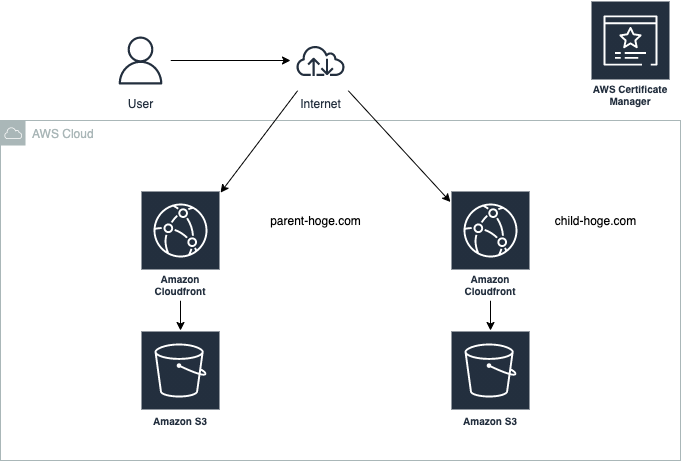

# S3 と CloudFront を ACM を利用して HTTPS 通信を行う

これらについて zennの以下スクラップに記載しています。

https://zenn.dev/bun913/scraps/89b634f797fa4a

やりたいこと

- まずハンズオンで S3 と CloudFront を使って S3 のリソースを CDN 経由で取得できるようにする
  - 2 つのリソースを作成
- freenom を使って独自ドメインを取得
  - 親となる独自ドメインを取得
  - サブドメインを用意(A レコードを作るだけ)
- ACM を利用してワイルドカードで証明書をプロビジョニングする
- ↑ で作成した 2 つの CDN それぞれで HTTPS 通信を利用できるようにプロビジョニングする

## ハンズオン

構成イメージ



### S3 の準備

- 以下 2 つのバケットを準備
  - cdn-practice-bun-parent
  - cdn-practice-bun-child
- バケットポリシーを以下の設定にしてパブリックにアクセスできるようにする
  - これはあくまで一時的に CDN 経由でしかアクセスできないようにする

```json
{
  "Version": "2012-10-17",
  "Statement": [
    {
      "Sid": "Statement1",
      "Effect": "Allow",
      "Principal": "*",
      "Action": "s3:GetObject",
      "Resource": "arn:aws:s3:::cdn-practice-bun-child/*"
    }
  ]
}
```

- それぞれのバケットに適当に画像をアップロードしておく

### CloudFrontの準備

- CloudFront のディストリビューションを作成
  - 1 つ目
    - parent のバケットをオリジンに
    - Cnamesに parent-pr-bun.comを入力
    - OAI を使ってバケットには CloudFront 経由のアクセスしかできないように設定する
  - 2 つめ
    - child のバケットをオリジンに
    - Cnamesに child-pr-bun.comを入力
    - それ以外は parent と同じ設定にする
  - ここまでで CloudFront 経由でのアクセスしかできなくなっていることを確認

### 独自ドメインの取得

- freenom うざかったからお名前.com で 1 円で取得
  - あえて Route53 に委託するのではなくお名前.com で一回やってみる
  - pr-bun.comを取得
- DNSレコードの設定で
  - parent.pr-bun.com を CloudFrontのpaerntの方でCNAMEレコードを登録
  - child.pr-bun.com を CloudFrontのchildの方でCNAMEレコードを登録


### ACMで証明書を準備


- ACM で管理ドメインに対する証明書を取得
  - pr-bun.com
  - \*.pr-bun.com
  - ↑ のようにしてワイルドカード証明書を取得
- お名前.comで作業
  - ↑でACMで証明書をプロビジョニングすることにより、ドメインの所有者かの検証用にDNSのCNAMEにレコードを登録するよう指示がある
  - その指示の通り、お名前.com側でDNSレコードを設定
- これで独自ドメインに向けてアクセスをすることで画像が表示されることに加えて以下を確認
  - 証明書を見るとちゃんと認証局がAmazonで pr-bun.comの証明ができている
  - paerntもchildも一つのワイルドカード証明書で登録できている!!

ハマったところ

- ACM を ap-northeast-1のリージョンで作成してしまった
- us-east1 にしないと CloudFront で使えない
- CloudFront側に 独自ドメインのCnamesを入力するのを忘れていた

DNSのCNAMEの反映はそれぞれ数分で完了していた（少なくとも日本国内では)
