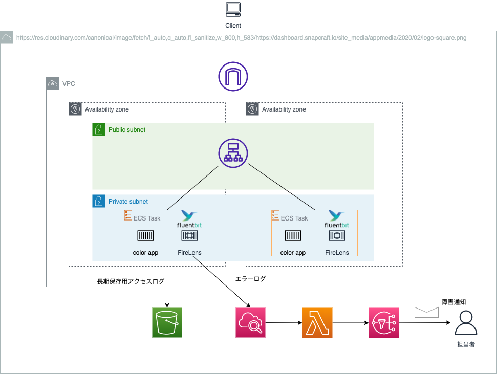

# ECSアプリケーションのログ収集・エラーログのサブスクリプションレシピ

システム構成図

## 今回やること

* ECSでアプリケーションを稼働させる
* タスクにはシンプルなWebアプリのコンテナとそのログを出力するためのFireLensのコンテナをサイドカーとして配置する
* アプリの全てのログはS3に出力させる(長期保存用)
* ただしエラーログに関しては、CloudWathLogsにも飛ばす
* CloudWatchLogsに飛んだログはlambdaを介して、SNSトピックを経由して運用担当者にEmail通知される
  * Slack通知までやりたいが、まずはEmail通知を導入する

## 今回やらないこと

* Codeシリーズを使ったCI/CDパイプライン
  * 別のリポジトリでやっているため今回は割愛
  * [参考](../simple_ecs_app/README.md)

## 事前設定

* ECRのレポジトリ作成は手動で行う
* ECRへのイメージプッシュは手動で行う
* アプリケーション用のリポジトリは別途用意(プライベートリポジトリ)
  * `/` にアクセスすると通常ページ
  * `/error` にアクセスするとエラーページに飛ぶ(エラーログが出力される)
