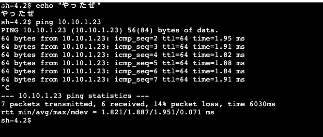

## プライベートサブネット間のEC2インスタンスって普通に疎通できたよね？

- 片方のEC2インスタンス(A)にはセッションマネージャーにてssh接続を行う
- 片方のEC2インスタンス(B)は ICMPの通信を許可して、Aからの通信を許可する

## 結論

VPCが同じで、セキュリティグループやネットワークACLの設定が正しければ、
AZが違ってもプライベートサブネット間のEC2インスタンスで疎通が可能！！

だって同じVPCの時点で通信できるんだもの。

## ひっかりそうになったところ

- そもそもプライベートサブネットにあるEC2インスタンスに接続するにはSSMなどのサービスの利用が必要
  - https://dev.classmethod.jp/articles/ssm-session-manager-private/
  - https://dev.classmethod.jp/articles/choosing-the-right-shell-access-solution-to-aws-ec2/
    - ↑からSSMのセッションマネージャーを利用
- ↑のためにVPCエンドポイント４種が必要
  - https://dev.classmethod.jp/articles/ssm-session-manager-private/
  - そのうちInterface型のエンドポイントについては、HTTPSのインバウンドを許可したセキュリティグループをアタッチする必要がある
- とはいえセッションマネージャーを利用するにはEC2インスタンスにyumでエージェントをインストールする必要がある
- AmazonLinuxの場合S3へのVPCエンドポイントがあれば、プライベートサブネットからyumができる
  - https://soypocket.com/it/ec2-yum-privatesubnet-s3endpoint/
- この調子でEC2インスタンスを作成
  - https://zenn.dev/bun913/scraps/4b4944238c8d1b
  - セッションマネージャーを利用するようにできるところまでは↑に記載
- 疎通を確認させたい方のEC2インスタンスはセキュリティグループで全てのICMPを許可しておく
- 以下AMazonLinux以外の場合
    - ↑のためにはVPCにNATゲートウェイを作成して、ルートテーブルでNATゲートウェイへの出口が必要
      - ↑そのためにVPCにインターネットゲートウェイを作成している必要がある
      - `has no Internet gateway attached` とか出る
      - インターネットゲートウェイはVPCにアタッチ
      - NATゲートウェイはサブネットにアタッチ
        - NATはプライベートサブネットないの複数のEC2インスタンスからのインターネットへの通信を一つのパブリックIPに変換する
        - NATはパブリックサブネットに配置しないといけないよ
    - サブネットとルートテーブルの設定
      - プライベートサブネットのルートテーブルには 0.0.0.0/0 の NATゲートウェイへのルートを追加
      - パブリックサブネットのルートテーブルには 0.0.0.0/0 の IGWへのルートを追加

