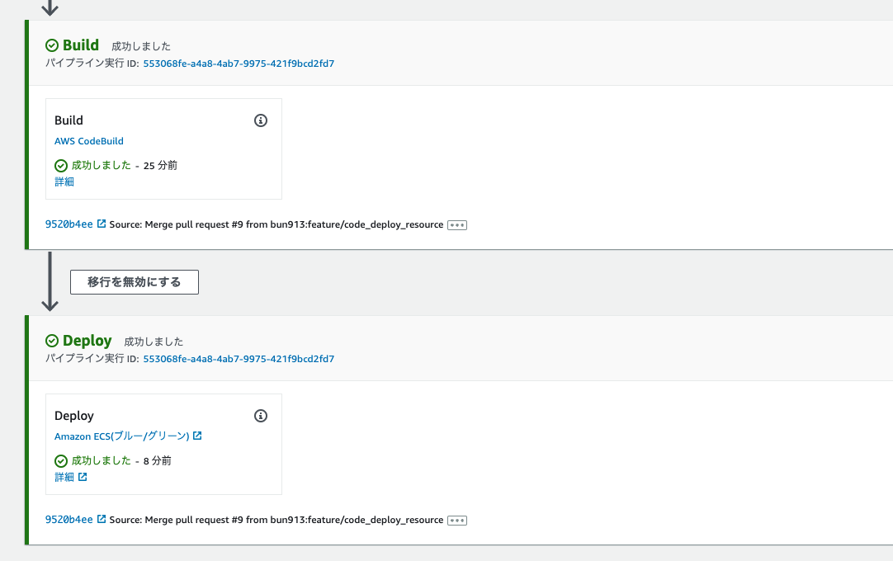
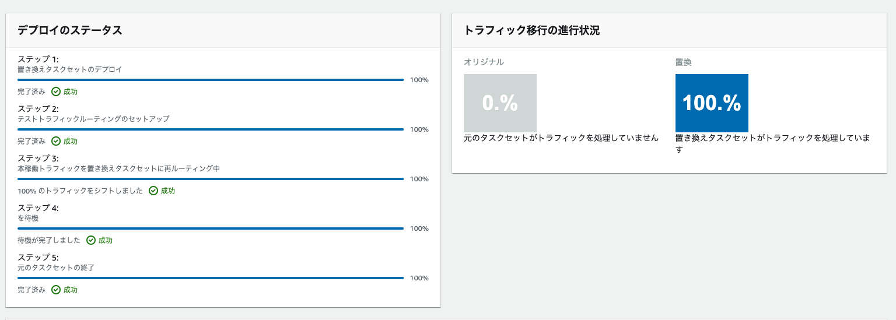

# ECSによるアプリの継続的デプロイ学習レシピ

システム構成図


## 今回やること

* 単独のコンテナだけで稼働するシンプルなウェブアプリケーションをFARGATE実行環境で稼働させる。
* また、継続的なデプロイパイプラインをAWSのCodeSeriesで実現する
  * CodePipeline
  * CodeBuild
  * CodeDeploy

## 今回やらないこと

* Terraformリポジトリの静的解析
  * tf validate
  * tf fmt など
  * 別途GithubActionsでやる
* AutoScalingの導入

## 事前設定

* ECRのレポジトリ作成は手動で行う
* ECRへのイメージプッシュは手動で行う
  * 通常はアプリ側の変更があったタイミングでCI/CIDにより最新イメージがプッシュされる想定
  * ↑の設定は別途CodeSeriesの学習で行う
* Githubに接続するためのCodeStarコネクション(Github version2)を作成しておく
  * https://tech.012grp.co.jp/entry/2021/02/15/192252#:~:text=DeploymentGroupName%20%3D%20var.codedeploy_deploy_group_name%0A%20%20%20%20%20%20%7D%0A%20%20%20%20%7D%0A%20%20%7D%0A%7D*,aws_codestarconnections_connection%E3%83%AA%E3%82%BD%E3%83%BC%E3%82%B9%E3%81%AB%E3%81%A4%E3%81%84%E3%81%A6,*Terraform%E3%81%A7%E4%BF%9D%E7%95%99
* アプリケーション用のリポジトリは別途用意(プライベートリポジトリ)
  * アプリケーションリポジトリに
  * taskdef.json　と
  * appspec.yaml を配置しておく
  * どちらもCodeDeployがBGデプロイをする際に利用する

taskdef.json

```json
{
  "executionRoleArn": "arn:aws:iam::${AWSアカウントID}:role/color-app-ecs-task-execution",
  "taskRoleArn": "arn:aws:iam::${AWSアカウントID}:role/color-app-ecs-task",
  "containerDefinitions": [
    {
      "logConfiguration": {
        "logDriver": "awslogs",
        "options": {
          "awslogs-group": "color-app-app",
          "awslogs-region": "ap-northeast-1",
          "awslogs-stream-prefix": "ecs"
        }
      },
      "portMappings": [
        {
          "hostPort": 8080,
          "protocol": "tcp",
          "containerPort": 8080
        }
      ],
      "environment": [
        {
          "name": "APP_COLOR",
          "value": "blue"
        }
      ],
      "cpu": 256,
      "readonlyRootFilesystem": true,
      "image": "<IMAGE1_NAME>",
      "essential": true,
      "name": "color"
    }
  ],
  "memory": "512",
  "compatibilities": ["EC2", "FARGATE"],
  "family": "color-app-task-def",
  "requiresCompatibilities": ["FARGATE"],
  "networkMode": "awsvpc",
  "cpu": "256"
}
```

appspec.yaml

```yaml
version: 1
Resources:
  - TargetService:
      Type: AWS::ECS::Service
      Properties:
        TaskDefinition: '<TASK_DEFINITION>'
        LoadBalancerInfo:
          ContainerName: 'color'
          ContainerPort: 8080
```

## 結果

このディレクトリ配下の `terrform apply` にてアプリケーションが起動する。

なお ブルーグリーンデプロイではCodeデプロイがALBのターゲットグループを入れ替えを行ってくれる。

Blue -> Green -> Blue -> Green

そのため各リソースでは lifecycle ignore_changes　を入れており、terraformによる不正なターゲットグループの更新などが発生しない様にしている。

以下の様にイメージ通りの挙動となった

### 変更の流れ

1. アプリのGithubのmainブランチに変更をコミット
2. CodePipelineが変更を検知
3. CodeBuildがDockerイメージをビルドして、ECRにプッシュ
4. CodeDeployがタスク定義を更新して、ブルーグリーンデプロイメントを開始
   1. 問題があればロールバックが発動して、元のリビジョンに戻る

コードパイプラインのイメージ





アプリの最初の状態


PRがマージされて新バージョンがリリースされた状態

